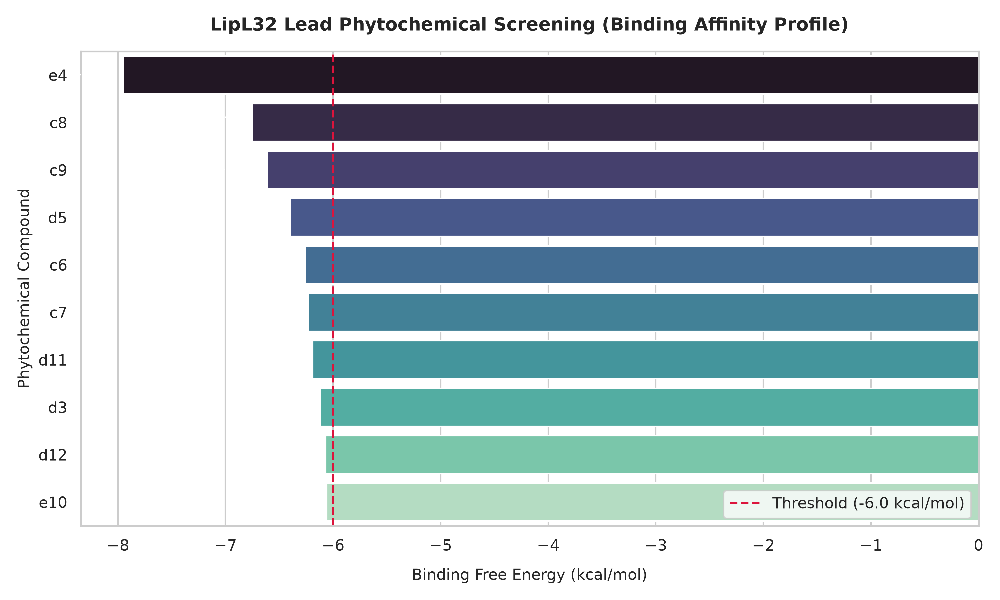

# In-Silico Molecular Docking & ADMET Screening of Phytochemicals Targeting *Leptospira* LipL32


## Project Overview
Leptospirosis is a widespread zoonotic infectious disease caused by pathogenic spirochetes of the genus *Leptospira*. LipL32 is the major outer membrane lipoprotein found exclusively in pathogenic *Leptospira* species, playing a crucial role during host-pathogen interactions and pathogenesis, making it an ideal therapeutic target.

This computational project evaluates a library of 44 phytochemicals sourced from medicinal plants (notably *Thymus vulgaris*, *Satureja*, and *Mentha*) to identify potential small-molecule inhibitors of the LipL32 protein via automated molecular docking and pharmacokinetic profiling.

---

## Computational Pipeline & Methodology

1. Target Preparation:
   * Target Protein: LipL32 outer membrane lipoprotein.
   * Structure Refinement: Polar hydrogen addition, Gasteiger charges assignment, and solvation parameters setup.

2. Ligand Library Construction:
   * Curated library of 44 bioactive phytochemical compounds.
   * Energy minimization and conformational optimization.

3. Molecular Docking (AutoDock 4):
   * Grid box configured to encompass putative functional binding pockets.
   * Lamarckian Genetic Algorithm (LGA) deployed with 24 independent docking runs per compound to ensure conformational sampling and reproducibility.
   * Assessment of binding free energies ($\Delta G$), estimated inhibition constants ($K_i$), and hydrogen bonding / hydrophobic contact networks.

4. Pharmacokinetics & Toxicity Profiling (ADMET):
   * Drug-Likeness: Lipinski's Rule of Five, Veber's rule, and bioavailability scores.
   * Pharmacokinetics & Safety: Human Intestinal Absorption (HIA), Blood-Brain Barrier (BBB) permeation, CYP inhibition, AMES toxicity, and carcinogenicity filters.

---

## Key Findings & Top Lead Compounds

Among the 44 screened compounds, several monoterpenes and phenolics exhibited favorable binding thermodynamics and clean pharmacokinetic safety profiles:
* Carvacrol: Strong localized binding interaction, favorable thermodynamic profile, and high intestinal absorption.
* Menthone: Favorable docking score, compact molecular geometry, and standard drug-likeness compliance.

The multi-parametric screening prioritized drug candidates meeting strict threshold criteria ($\Delta G \leq -6.0\text{ kcal/mol}$, $\text{HIA} \geq 80\%$, non-mutagenic, non-carcinogenic).


*Figure: Binding affinity and inhibition constant profile of screened phytochemical candidates.*

---

## Python Screening & Data Automation Pipeline

An automated Python script (lipl32_lead_screening.py) was developed for post-docking analysis and candidate prioritization:

# Execute lead screening and multi-panel visualization pipeline
python lipl32_lead_screening.py
Data Normalization: Parses multi-parameter spreadsheets containing raw binding energies, 
𝐾𝑖 values, and ADMET profiles.
Threshold-Based Filtering: Automatically filters leads based on thermodynamic and safety criteria.
Visualization: Exports publication-ready high-resolution comparative bar plots (lipl32_screening_summary.png).

---

## Repository Structure
```text
leptospirosis-lipl32-docking-screening/
├── README.md                          # Comprehensive project documentation
├── docking_and_admet_results.xlsx     # Raw docking scores and ADMET dataset
├── lipl32_lead_screening.py           # Automated lead filtering & visualization script
├── lipl32_screening_summary.png       # Generated binding affinity & screening plot
└── requirements.txt                   # Environment dependencies
```
## Author & Project Background
- Pipeline Developer & Researcher: Taban Tavanmand (documented as Atefeh Tavanmand in academic training records)
- Research Framework: BioCamp – Advanced Industrial Drug Design & Bioinformatics Pipeline
- Core Competencies: Structural Bioinformatics, In-Silico Molecular Docking, ADMET Profiling, Computational Screening & Python Data Automation.
